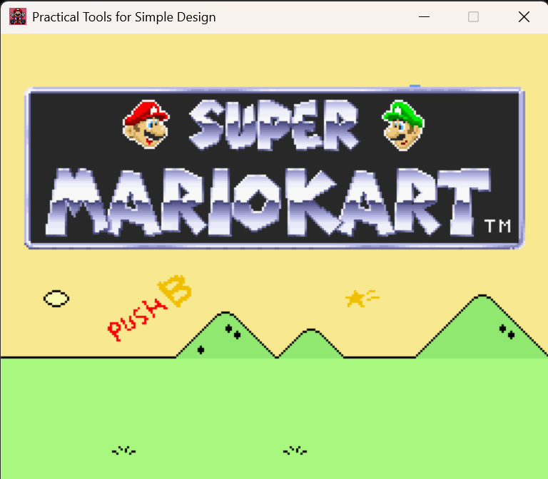
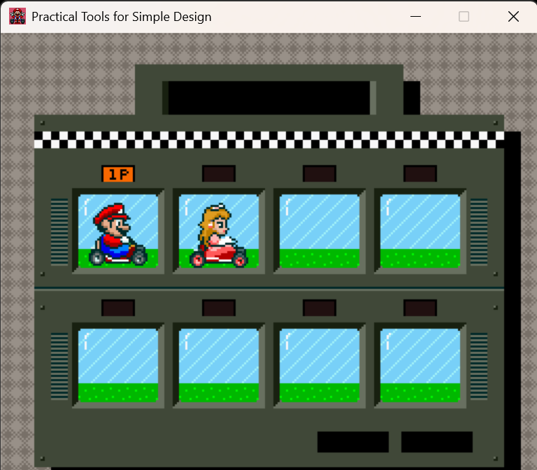
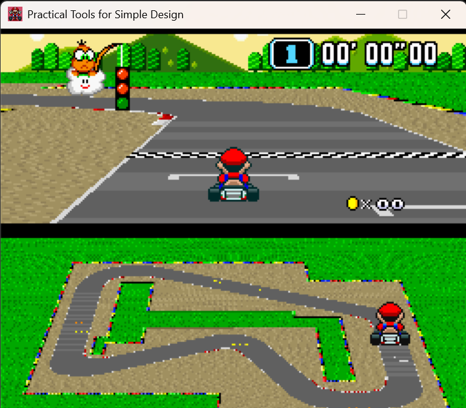
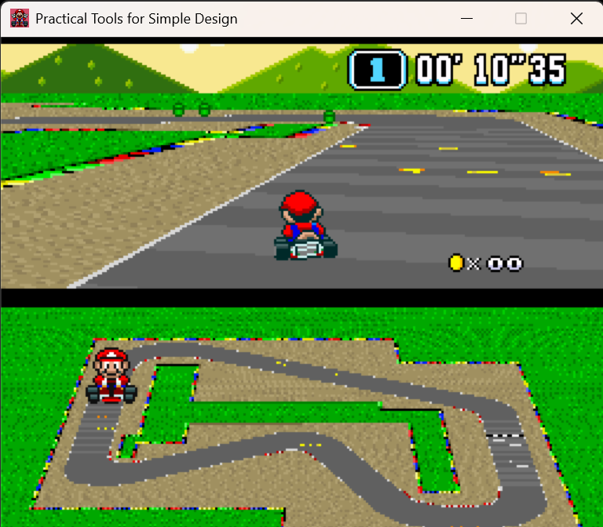
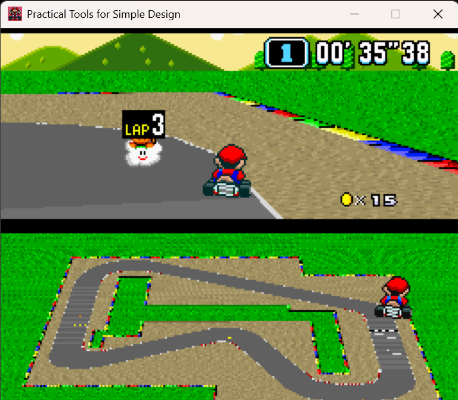
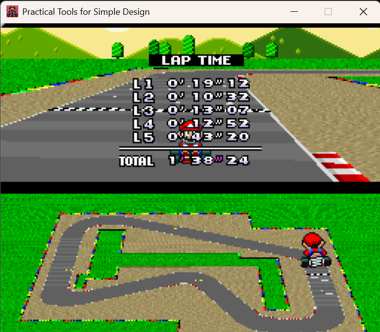
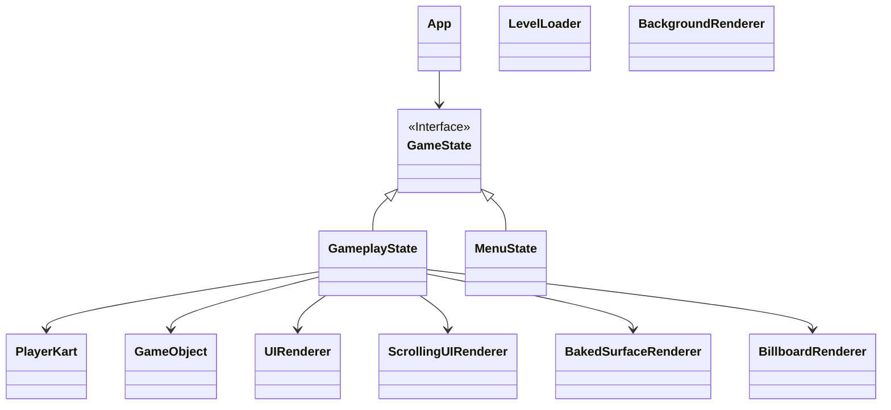
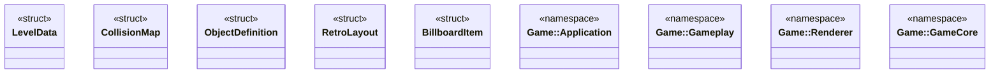

# 2026 OOPL Final Report

## 組別資訊

* **組別**：44
* **組員**：113820020 林政德
* **復刻遊戲**：超級瑪利歐賽車 (Super Mario Kart - SNES)

---

## 專案簡介

### 遊戲簡介

復刻 1992 年於超級任天堂 (SNES) 推出的經典賽車遊戲《超級瑪利歐賽車 (Super Mario Kart)》中的單人計時賽關卡，並加上排名賽的金幣。

### 組別分工

遊戲由我一個真人實作。

---

## 遊戲介紹

### 遊戲規則

#### 遊戲目標

玩家選擇喜愛的賽車手，在經典的Mario Circuit 賽道上奔馳。
在 Lakitu 舉起綠燈後起跑，必須依序通過場景中埋設的檢查點，完成指定圈數 (5 圈) 即可通過終點線完賽，系統將會結算並印出每一圈的單圈耗時以及總成績。

#### 按鍵說明

##### 賽道駕駛操作
* `W ` - 加速油門 (Accelerate)
* `S ` - 煞車
* `A / D` - 轉向方向盤 (Steering)
* `Space` - 選單頁面確認鍵
* `R` - Debug 用快速重來機制
* `ESC` - 結束遊戲並退出

##### 選單 UI 操作說明
* `W / S` - 於主選單上下移動選取項目（如人數、規則模式切換）
* `A / D` - 於車手選擇頁面進行 8 方向格位切換、於確認頁面切換 Yes / No 選項
* `Space` - 選單頁面通用確認鍵（按下一頁推進至下一選單）

##### 專案開發限制備註
* **僅支援單人模式 (1P)**：主選單人數選擇階段僅開放「1 PLAYER」選項，若選擇雙人模式，系統將攔截無法推進。
* **僅支援計時賽 (Time Trial)**：主選單模式選擇僅開放「TIME TRIAL」計時賽模式，若選擇排名模式，系統將攔截無法推進。
* 
#### 異常地形與障礙狀態

* **賽道道路 (Road)**：100% 正常抓地力與最高速。
* **外圍草地 (Grass)**：抓地力阻力大幅飆升且最高速被大幅限制。
* **立體水管 (Pipe)**：實體碰撞障礙物，撞擊後會被強烈彈開並發出碰撞音效。

### 遊戲畫面

| 說明 | 畫面 |
| --- | --- |
| 主選單待機畫面 |  |
| 角色選擇頁面 |  |
| Lakitu 起跑倒數計時 |   |
| 賽道畫面 |  |
| 過圈動畫提示特寫 |  |
| 結束成績結算頁面 |  |

---

## 程式設計

### 程式架構

#### 繼承架構圖

#### 物件及命名空間

* `Game::Application` - 包含應用程式進入點與核心控制類別 (`App`)
* `Game::Gameplay` - 包含實際參與遊戲邏輯互動的實體 (`PlayerKart`, `GameObject`)
* `Game::Renderer` - 包含所有封裝了 OpenGL Shader 與繪製邏輯的渲染器
* `Game::GameCore` - 包含跨系統共用的核心資料結構與全域設定 (`RetroLayout`)

#### 資料結構

##### 純資料結構

* `LevelData` - 儲存從 JSON 載入的賽道完整資訊，包含圈數、起跑線位置、檢查點 (Checkpoints)、硬幣與水管座標
* `CollisionMap` - 儲存地圖的像素顏色陣列，提供 `GetPixelColor` 方法以實現精確的地形材質判定（如草地減速、牆壁反彈）
* `ObjectDefinition` - 物件的共用定義資料，包含碰撞半徑與細節層次 (`SpriteLOD`) 的多角度圖片對照表
* `RetroLayout` - 定義復古遊戲畫面的切割佈局，以常數定義賽道區塊、小地圖區塊與 UI 邊界的像素高度
* `BillboardItem` - 傳遞給 `BillboardRenderer` 的繪製指令結構，包含世界座標、朝向角度與定義指標
* `RotatedBakeItem` - 紀錄需要旋轉並預先烘焙至賽道貼圖上的物件資訊

##### 參與繼承的物件

* `Game::States::GameState` - 遊戲狀態的抽象基底介面，定義了生命週期 (`Start`, `Update`, `Render`, `End`)
* `GameplayState` - 負責核心賽車遊玩邏輯、賽道渲染、物件碰撞判定與 UI 計分板的運作
* `MenuState` - 負責標題畫面、遊玩人數選擇、規則設定與角色選單的邏輯與渲染

##### 不參與繼承的物件

* `App` - 遊戲核心控制器，持有當前 `GameState` 的指標，負責驅動主迴圈與狀態機切換
* `GameObject` - 地圖上的可互動物件（如金幣、水管），以組合方式綁定碰撞體半徑與碰撞回調函式
* `PlayerKart` - 玩家的卡丁車實體，封裝了所有的物理運動邏輯（加速、煞車、摩擦力）與多角度視角的 Sprite 狀態計算
* `LevelLoader` - 關卡系統，負責解析 JSON 格式的賽道檔案與讀取 PNG 像素級碰撞圖 (`CollisionMap`)
* `UIRenderer` - 負責 2D 靜態與動態 UI 繪製的渲染器（支援佇列繪製與正交投影）
* `ScrollingUIRenderer` - 負責捲動背景（如天空、遠山）與無限捲動 UI 的渲染器
* `BakedSurfaceRenderer` - 負責 Mode 7 偽 3D 賽道投影的核心渲染器，並支援將靜態物件預先烘焙（Bake）至地圖材質上
* `BillboardRenderer` - 負責 2.5D 廣告牌物件渲染，根據攝影機深度與角度動態計算並排序繪製精靈圖 (Sprite)
* `BackgroundRenderer` - 負責基礎全螢幕背景的繪製

### 程式技術

本專案的核心設計思想是：**「組合優於繼承 (Composition over Inheritance)」** 與 **「渲染邏輯徹底解耦」**，採用物件導向 (Object-Oriented) 結合資料導向 (Data-Oriented) 的設計思維來提升圖形運算效能。

#### 一、核心架構與物件設計 (Core Architecture & Object Design)

本遊戲的核心架構由幾個關鍵要素支撐：

##### 1. 多層次狀態機驅動 (Hierarchical State Machine)

遊戲的宏觀流程透過繼承 `GameState` 的 `GameplayState` 與 `MenuState` 進行切換；而在各個 State 內部，又實作了微觀的 SubState 狀態機。例如 `GameplayState` 內部包含了 `GameplaySubState`（如起跑燈號 `AnimLakitu1` 到 `AnimLakituLight3`、遊戲進行中 `Game`、完賽演出 `AnimFinish`、分數結算 `ShowScore` 等），使得複雜的時間軸動畫與鏡頭控制能被精準拆分，不干擾核心更新迴圈。

##### 2. 渲染管線的分離與專業化

不同於將渲染方法寫入實體內部的傳統作法，專案將渲染邏輯拆分為高度專業化的 Renderer 類別：

* **Mode 7 賽道投影 (`BakedSurfaceRenderer`)：** 將 2D 賽道圖透過客製化的 Shader (`Mode7.frag`) 進行透視除法與矩陣運算，投影成 3D 視角。
* **告示牌技術 (`BillboardRenderer`)：** 處理地圖上的立體物件（如水管、其他角色）。Renderer 會根據物件的 3D 世界座標、攝影機的 FOV 與 Yaw 角度，計算出物件在 2D 螢幕上的投影位置、縮放比例與深度，並自動進行深度排序 (Depth Sorting) 以確保正確的遮擋關係。

##### 3. 像素級地形與碰撞偵測

賽道的物理偵測摒棄了傳統的幾何網格碰撞，改用讀取整張 `CollisionMap` 圖片的像素色彩來進行判定。
透過將玩家的空間座標轉換為像素索引，判斷腳下像素的 RGB 值。若讀取到特定顏色（如純黑），則判定為進入草地並觸發減速；讀取到邊界顏色，則視為撞牆並根據入射角進行彈性反彈計算。

##### 4. 靜態物件預烘焙優化 (Texture Baking)

為了解決滿地金幣造成 Draw Call 過高的效能瓶頸，專案實作了 `BakeObject` 機制。在遊戲初始化時，將所有靜態的金幣直接「畫 (Blit)」到 `workingTrackSurface_` 賽道材質上。玩家在畫面上看到的是已經合成為一張圖的賽道。當玩家吃到金幣時，系統會呼叫 `RestoreBakedObject`，利用原始乾淨的賽道底圖將該區域「補丁」回去，實現了極致的渲染效能優化。

#### 二、中央請求與統一調度 (依賴注入與回調)

##### 1. Lambda 碰撞回調機制 (Collision Callbacks)

為了讓 `GameObject` 保持輕量且不依賴外部系統，專案大量使用了 `std::function` 作為回調介面。
在 `GameplayState::Start` 初始化地圖物件時，將處理金幣得分、播放音效、反彈物理運算等邏輯封裝進 Lambda 中，並注入給 `GameObject`。當 `GameObject::UpdateCollision` 偵測到邊界重疊時，便會直接觸發該 Lambda。地圖物件本身完全不需要知道系統如何計分或播放音效，達成了完美的職責分離。

##### 2. 動態視角與多角度精靈圖 (Directional Sprites)

在 2.5D 遊戲中，卡丁車需要根據攝影機的角度呈現不同的面向。透過 `GetAngleDifference` 計算「物件朝向向量」與「攝影機朝向向量」的夾角，並透過查表法 (`m_MarioKartSpritesLUT`) 利用二元搜尋 (`std::lower_bound`) 快速映射出對應的圖片索引。加上左右水平翻轉機制 (`outFlip = true`)，僅需 12 張素材就能流暢展現 22 個角度的 3D 視覺錯覺。

#### 三、資料驅動與細節層次技術 (Data-Driven & LOD)

##### 1. 資料驅動的地圖載入 (`LevelLoader`)

關卡的所有的起點、檢查點、硬幣與水管座標完全由 `Level1.json` 定義。`LevelLoader` 利用 `nlohmann::json` 將其解析為強型別的 `LevelData` 結構，使得設計師可以直接修改 JSON 調整關卡難度與物件配置，無須重新編譯 C++ 程式碼。

##### 2. 細節層次系統 (Level of Detail - LOD)

為了產生近大遠小的效果，`ObjectDefinition` 中實作了 `SpriteLOD` 系統。對於距離攝影機極遠的物件（例如遠處的水管），系統會讀取 `lod.maxDistance` 判斷，自動調用解析度較低的圖片；只有在靠近攝影機時，才會切換為高精度的素材，增加畫面空間感。

### 使用到 AI/AI Agent 的部分

在本次專案的開發過程中，將 AI (Gemini) 定位為「引擎底層技術的架構顧問」與「高階數學算法輔助器」，實作了「架構師主導的 AI 協作 (Architect-Driven AI Collaboration)」開發模式：

1. **圖形學 Shader 數學推導與除錯：**
實作 Mode 7 與 Billboard 投影時，遇到了許多視角矩陣與 UV 映射錯位的問題。我會將 C++ 負責計算 `rayDir` 與 `worldPos` 的片段，連同 GLSL Fragment Shader 的代碼提供給 AI。AI 協助我精確找出了透視除法中 Z 軸反轉的問題，並引導我將 C++ 的視角計算（純像素單位）與 Shader 的 UV 映射達成完美的比例對齊。
1. **效能導向架構 (DOD) 討論：**
開發初期，我曾考慮使用深層的類別繼承（如 `Kart -> Entity -> GameObject`）來管理所有場景實體。但透過與 AI 進行 C++ 記憶體佈局與 CPU 快取命中的探討，最終決定捨棄**傳統 OOP 肥大物件**的做法，轉而採用組合模式，並分離出專屬的 Renderer。這使得資料的傳遞更加緊湊。
1. **複雜 API 封裝與跨平台編譯：**
在構建自定義渲染引擎封裝時，AI 協助我快速釐清了 OpenGL VAO/VBO 與 Framebuffer Object (FBO) 在 SDL2 視窗中的掛載順序，並順利配置了 `CMakeLists.txt` 中與 PTSD 引擎的依賴鏈結，省去了大量查閱 API 文件的時間。
1. **動態記憶體除錯機制：**
當實作 `BakeObject` 時，遇到了 SDL Surface 像素操作導致的記憶體存取越界 (Segmentation Fault) 問題。我透過截取日誌並與 AI 討論，AI 指出了 RGBA32 格式在不同位元組對齊下的 `pitch` 差異，並協助我撰寫了完全不依賴三角函數的「純整數像素矩陣映射」旋轉算法，確保了繪製的穩定與極速。

---

## 結語

### 問題與解決方法

1. **跨平台 MSVC 編譯器中文註解引發的「食字」語法大爆炸 Bug**
* **問題**：專案 push 到 Git 後重新下載，在 Visual Studio 上編譯會噴出 100 個以上莫名其妙的「遺漏分號」、「this 只能在成員函數內使用」等慘烈報錯，但代碼明明沒有錯。
* **解決方案**：發現這是因為微軟編譯器預設使用 ANSI 讀取 UTF-8 檔案，將中文註解（如「碼」、「蓋」）的結尾位元組誤認成了換行反斜線 `\\`，導致下一行的有效代碼全部被當成註解「吞掉」了。最終在 `CMakeLists.txt` 中加入 `target_compile_options(MyGame PRIVATE "/utf-8")`，強制編譯器用 UTF-8 解析，順利將錯誤歸零。

2. **Mode 7 地面紋理頻繁動態綁定引發的效能隱患 (烘焙與局部修補技術)**
* **問題**：賽道上有大量的金幣與地磚動畫，如果每個金幣都當作一個獨立的 3D Billboard 來渲染，會產生龐大的 Draw Call，且無法完美貼平具有透視感的 Mode 7 地面。
* **解決方案**：實作 `BakeObject` 技術。在遊戲載入時，直接呼叫 `SDL_BlitSurface` 將金幣的 2D 像素「烙印」在賽道地圖表面（`workingTrackSurface_`），讓它隨 Mode 7 一起打包投影。當玩家踩到金幣後，利用 `RestoreBakedObject` 函數，僅抓取乾淨無污染的 `cleanTrackSurface_` 對應矩形像素進行局部局部修補覆蓋，完美兼顧了復古還原度與高執行期幀率。

3. **狀態機切換時的計時器殘留與視覺瞬間消失地雷 (Timer Carryover)**
* **問題**：當玩家在計分板按下 Space 鍵準備回選單時，畫面原本應該有 0.8 秒的平滑淡出動畫，卻一幀都沒播直接卡進黑幕。
* **解決方案**：這是在狀態機設計中非常經典的計時器未重置陷阱。因為 `m_StateTimer` 在計分板停留時一直在偷偷累加，進入淡出狀態的第一幀就已經大於 0.8 秒。在空白鍵按下判定內強制加上 `m_StateTimer = 0.0f;` 清空，並將 `ShowScore` 與 `AnimToMenu` 的渲染 case 合併，防止按下的瞬間計分板立刻消失，完美實現了平滑的畫面與音樂淡出。

4. **2.5D 廣告牌 (Billboard) 的深度排序閃爍與 Initializer List 報錯**
* **問題：** 在同時渲染多根水管與對手卡丁車時，由於關閉了深度寫入，物件繪製順序錯亂導致遠處的水管遮擋了近處的車輛。此外，在 C++ 建構 RenderCommand 佇列時，頻繁遭遇編譯器的 Initializer List 類型推導報錯。
* **解決方案：** 在 `BillboardRenderer` 中導入了 `drawQueue` 佇列機制。在每一幀遍歷物件時，先不立即發出 OpenGL Draw Call，而是計算好每個物件相對於攝影機的 `depth`，存入結構體佇列中。隨後使用 `std::sort` 依照深度由大到小（由遠到近）進行排序，最後再一次性批次渲染，解決了視覺遮擋問題；同時透過明確指定 `RenderCommand{...}` 結構體成員型別，修復了 C++ 編譯器的列表初始化報錯。

### 自評

| 項次 | 項目 | 完成 |
| --- | --- | --- |
| 1 | 這是範例 | V |
| 2 | 完成專案權限改為 public | V |
| 3 | 具有 debug mode 的功能 | V |
| 4 | 解決專案上所有 Memory Leak 的問題 | V |
| 5 | 報告中沒有任何錯字，以及沒有任何一項遺漏 | V |
| 6 | 報告至少保持基本的美感，人類可讀 | V |

### 心得

在修習這門實習課程之前，我對寫程式的認知多半停留在「解決當前作業」或「實現單一演算法」的階段，寫出來的程式碼多是一次性、缺乏長遠架構思量的產物。然而，本次實習選擇挑戰從零開始、不依賴現代商業引擎，純手刻復刻 SNES 經典的《超級瑪利歐賽車 (Super Mario Kart)》，讓我徹底經歷了一場軟體工程的洗禮。

這款遊戲的底層核心是 2D 偽 3D 的 Mode 7 渲染與立體 Billboard 投影，加上複雜的卡丁車物理與動態事件判定。面對如此龐大的系統，如果沒有嚴謹的物件導向架構支持，程式碼會在開發中後期迅速坍塌。這門課讓我深刻體會到，好的 OOP 設計不僅是語法上的多型或封裝，更是如何透過劃分職責，讓系統的每個分子都能自給自足，卻又能在大架構下協同運作。

### 貢獻比例

| 組員 | 貢獻比例 |
| --- | --- |
| 林政德 | 100% |

## 素材來源標示 (Credits & Acknowledgments)

本專案為學術研究與程式設計練習之復刻作品，所有遊戲內使用之影音與圖像素材版權皆歸原創作者或其所屬公司（Nintendo）所有。本專案絕不應用於任何商業營利行為。

以下為本專案所使用之素材與第三方開源資源來源清單，向所有無私分享資源的創作者與社群致以最深的謝意。

## 音樂與音效 (Audio & Sound Effects)

背景音樂與音效多來自經典《Super Mario Kart》遊戲之拆包或原聲帶資源。

* **背景音樂 (BGM)**
  * 來源網站：[Khinsider](https://downloads.khinsider.com/game-soundtracks/album/super-mario-kart-gamerip)
  * 使用曲目：
    * `1-02. Title Screen`
    * `1-03. Main Menu`
    * `1-04. Race Fanfare`
    * `1-05. Mario Circuit`
    * `1-30. Mario Circuit (Final Lap)`
    * `2-07. Final Lap Notice (Prototype 1992-04-13)`
    * `2-09. New Record (Prototype 1992-04-13)`
    * `2-12. Mario's Ranks (Prototype 1992-04-13)`

* **遊戲音效 (SFX)**
  * 來源網站：[Super Luigi Bros](https://www.superluigibros.com/super-mario-kart-sound-effects-wav)
  * 使用音效：
    * `coin.wav` (吃金幣)
    * `menumove.wav` (切換選取)
    * `menuselect.wav` (確認選取)
    * `racestart.wav` (起跑音效)
    * `thudpipe.wav` (撞擊水管)

## 圖像與精靈圖 (Graphics & Sprites)

遊戲場景、UI、卡丁車動態精靈圖等視覺素材。

* **卡丁車與角色 (Karts & Drivers)**
  * 來源網站：[The Spriters Resource](https://www.spriters-resource.com/snes/smariokart/)
  * 使用素材：Mario Kart (22 視角精靈圖)、Peach Kart (22 視角精靈圖)、Lakitu (紅綠燈與過圈提示)。

* **賽道與環境 (Tracks & Environments)**
  * 來源網站：[The Spriters Resource](https://www.spriters-resource.com/snes/smariokart/)
  * 使用素材：Mario Circuit 1 (包含 `track.png`, `sky.png`, `trees.png`, `collision.png`, `out_of_bounds.png`)、水管障礙物 (`pipe` LOD 系列)。

## 🛠️ 第三方開源函式庫 (Third-Party Libraries)

本專案底層渲染與邏輯運算依賴以下優秀的開源函式庫與框架：

* **[PTSD 遊戲引擎](https://github.com/ntut-open-source-club/practical-tools-for-simple-design)**
  * 簡介：由北科開源社 (NTUT Open Source Club) 維護開發之 C++ 輕量級 2D/3D 遊戲引擎封裝。
* **[nlohmann/json](https://github.com/nlohmann/json)**
  * 簡介：適用於現代 C++ 的 JSON 解析函式庫（用於解析賽道與關卡設定檔）。
