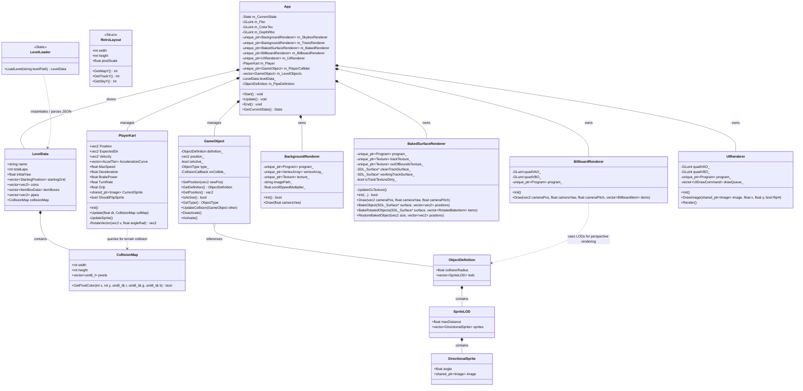

```mermaid

classDiagram
    %% --------------------------------------------------------
    %% Application Layer
    %% --------------------------------------------------------
    class App {
        -State m_CurrentState
        -GLuint m_Fbo
        -GLuint m_ColorTex
        -GLuint m_DepthRbo
        -unique_ptr~BackgroundRenderer~ m_SkyboxRenderer
        -unique_ptr~BackgroundRenderer~ m_TreesRenderer
        -unique_ptr~BakedSurfaceRenderer~ m_BakedRenderer
        -unique_ptr~BillboardRenderer~ m_BillboardRenderer
        -unique_ptr~UIRenderer~ m_UIRenderer
        -PlayerKart m_Player
        -unique_ptr~GameObject~ m_PlayerCollider
        -vector~GameObject~ m_LevelObjects
        -LevelData levelData_
        -ObjectDefinition m_PipeDefinition
        +Start() void
        +Update() void
        +End() void
        +GetCurrentState() State
    }

    %% --------------------------------------------------------
    %% GameCore Layer
    %% --------------------------------------------------------
    class LevelData {
        +string name
        +int totalLaps
        +float initialYaw
        +vector~StartingPosition~ startingGrid
        +vector~vec2~ coins
        +vector~ItemBoxData~ itemBoxes
        +vector~vec2~ pipes
        +CollisionMap collisionMap
    }
    class CollisionMap {
        +int width
        +int height
        +vector~uint8_t~ pixels
        +GetPixelColor(int x, int y, uint8_t& r, uint8_t& g, uint8_t& b) bool
    }
    class ObjectDefinition {
        +float collisionRadius
        +vector~SpriteLOD~ lods
    }
    class SpriteLOD {
        +float maxDistance
        +vector~DirectionalSprite~ sprites
    }
    class DirectionalSprite {
        +float angle
        +shared_ptr~Image~ image
    }
    class RetroLayout {
        <<Struct>>
        +int width
        +int height
        +float pixelScale
        +GetMapY() int
        +GetTrackY() int
        +GetSkyY() int
    }

    %% --------------------------------------------------------
    %% Gameplay Layer
    %% --------------------------------------------------------
    class GameObject {
        -ObjectDefinition definition_
        -vec2 position_
        -bool isActive_
        -ObjectType type_
        -CollisionCallback onCollide_
        +SetPosition(vec2 newPos)
        +GetDefinition() ObjectDefinition
        +GetPosition() vec2
        +IsActive() bool
        +GetType() ObjectType
        +UpdateCollision(GameObject other)
        +Deactivate()
        +Activate()
    }
    class PlayerKart {
        +vec2 Position
        +vec2 ExpectedDir
        +vec2 Velocity
        +vector~AccelTier~ AccelerationCurve
        +float MaxSpeed
        +float Deceleration
        +float BrakePower
        +float TurnRate
        +float Grip
        +shared_ptr~Image~ CurrentSprite
        +bool ShouldFlipSprite
        +Init()
        +Update(float dt, CollisionMap colMap)
        -UpdateSprite()
        -RotateVector(vec2 v, float angleRad) vec2
    }

    %% --------------------------------------------------------
    %% Renderers Layer
    %% --------------------------------------------------------
    class BackgroundRenderer {
        -unique_ptr~Program~ program_
        -unique_ptr~VertexArray~ vertexArray_
        -unique_ptr~Texture~ texture_
        -string imagePath_
        -float scrollSpeedMultiplier_
        +Init() bool
        +Draw(float cameraYaw)
    }
    class BakedSurfaceRenderer {
        -unique_ptr~Program~ program_
        -unique_ptr~Texture~ trackTexture_
        -unique_ptr~Texture~ outOfBoundsTexture_
        -SDL_Surface* cleanTrackSurface_
        -SDL_Surface* workingTrackSurface_
        -bool isTrackTextureDirty_
        -UpdateGLTexture()
        +Init(...) bool
        +Draw(vec2 cameraPos, float cameraYaw, float cameraPitch)
        +BakeObject(SDL_Surface* surface, vector~vec2~ positions)
        +BakeRotatedObjects(SDL_Surface* surface, vector~RotatedBakeItem~ items)
        +RestoreBakedObject(vec2 size, vector~vec2~ positions)
    }
    class BillboardRenderer {
        -GLuint quadVAO_
        -GLuint quadVBO_
        -unique_ptr~Program~ program_
        +Init()
        +Draw(vec2 cameraPos, float cameraYaw, float cameraPitch, vector~BillboardItem~ items)
    }
    class UIRenderer {
        -GLuint quadVAO_
        -GLuint quadVBO_
        -unique_ptr~Program~ program_
        -vector~UIDrawCommand~ drawQueue_
        +Init()
        +DrawImage(shared_ptr~Image~ image, float x, float y, bool flipH)
        +Render()
    }

    %% --------------------------------------------------------
    %% Systems Layer
    %% --------------------------------------------------------
    class LevelLoader {
        <<Static>>
        +LoadLevel(string levelPath) LevelData
    }

    %% --------------------------------------------------------
    %% Relationships
    %% --------------------------------------------------------
    App *-- BackgroundRenderer : owns
    App *-- BakedSurfaceRenderer : owns
    App *-- BillboardRenderer : owns
    App *-- UIRenderer : owns
    App *-- PlayerKart : manages
    App *-- GameObject : manages
    App *-- LevelData : stores

    GameObject o-- ObjectDefinition : references
    ObjectDefinition *-- SpriteLOD : contains
    SpriteLOD *-- DirectionalSprite : contains
    
    LevelData *-- CollisionMap : contains
    LevelLoader ..> LevelData : instantiates / parses JSON

    PlayerKart ..> CollisionMap : queries for terrain collision
    BillboardRenderer ..> ObjectDefinition : uses LODs for perspective rendering

```
